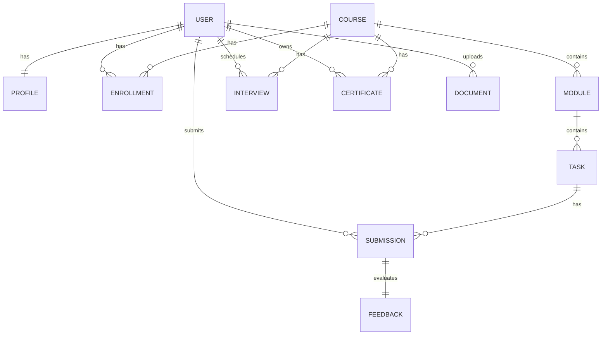

# RageLabs Learning - Architecture Documentation

This document outlines the technical architecture of the **RageLabs Learning** platform, transition from static frontend files to a robust Python + Django database-backed web application.

---

## 1. Directory Structure

The codebase is organized as a modular Django project:

```text
RageLabs Learning
│
├── manage.py                 # Django entrypoint script
├── db.sqlite3                # Persistent SQLite database
├── seed.py                   # Populates baseline demo data & user profiles
│
├── raise_labs/               # Core Django Settings & Configuration
│   ├── settings.py           # Core settings (apps list, database, custom auth configuration)
│   ├── urls.py               # Central URL router
│   └── wsgi.py
│
├── apps/                     # Application Apps
│   ├── accounts/             # Authentication & profiles (User, Profile models)
│   ├── courses/              # Programs & checkout (Course, Enrollment, Document models)
│   ├── learning/             # Student workspace & evaluations (Module, Task, Submission, Feedback models)
│   └── staff/                # Educator, HR, and Admin command center views
│
└── templates/                # Reusable Layout Base Templates
    ├── base.html             # Common head resources, Tailwind rules, custom CSS
    ├── base_public.html      # Public pages wrapper (homepage, about, footer)
    ├── base_student.html     # Student workspace layout (sidebar & bottom nav)
    └── base_staff.html       # staff layout (educator/hr/admin sidebar panels)
```

---

## 2. Database Models & ERD Schema



### App Models Description

#### Accounts App
- **User**: Custom user model inheriting from Django's `AbstractUser` with a `role` field.
  - Roles: `STUDENT`, `EDUCATOR`, `HR`, `ADMIN`.
- **Profile**: One-to-one relationship with `User` containing personal data (`name`, `bio`, `github_url`, `linkedin_url`). Automatically created upon user registration.

#### Courses App
- **Course**: The basic program object. Can be an `INTERNSHIP` or a paid `TRAINING` program. Defines duration, price, and difficulty levels.
- **Enrollment**: Many-to-many relationship mapping student to course. Stores progress percentages, level progression, and payment confirmations.
- **Document**: Registry of files linked to a student (certificates, training resources, or uploaded documents).

#### Learning App
- **Module**: Step-by-step curriculum section mapped to a Course.
- **Task**: Practical task assignments or Capstone Project milestones mapped to a Module.
- **Submission**: Student submissions matching task rubrics. Tracks task status: `Submitted`, `Under Review`, `Passed`, `Needs Improvement`, `Failed`.
- **Feedback**: Evaluator grades containing strengths, improvements, score, and retry indicators.
- **Interview**: Technical interview scheduled at the end of Training level requirements.
- **Certificate**: Cryptographic badge issued to students upon passing the final interview.

---

## 3. Security & Role Permissions

Operational panels are gated using role-based checks (`user_passes_test` decorators):
1. **Student Workspace**: Access is granted to all authenticated students (`@login_required`).
2. **Educator Studio**: Gated to users with the `EDUCATOR` role. Enables configuring courses, modules, and reviewing curriculum templates.
3. **HR Talent Console**: Gated to users with the `HR` role. Enables searching candidate folders and auditing portfolios.
4. **Admin Console**: Gated to users with the `ADMIN` role. Operational control center to manage submissions, view system diagnostics, and audit evaluations.
