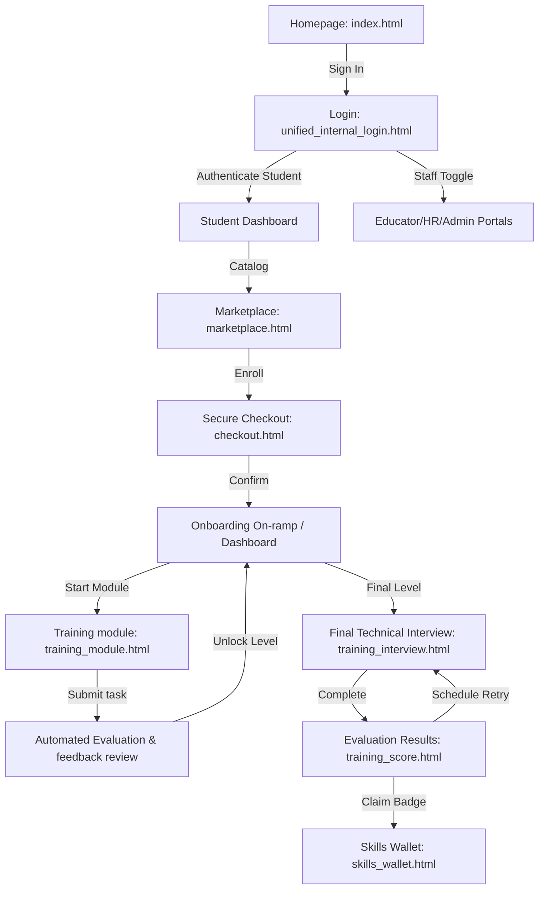

# Raise Labs Learning - Platform Transition Walkthrough

All tasks required to rebuild and transition the static platform to a professional, database-driven **Python + Django** application called **Raise Labs Learning** have been successfully executed and verified.

---

## Technical Transformation Summary

### 1. Database-Backed Operations & Models
- Built persistent schemas for **Users**, **Profiles**, **Courses**, **Enrollments**, **Modules**, **Tasks**, **Submissions**, **Feedback**, **Interviews**, and **Certificates**.
- Run initial migrations and populated standard demo data using `seed.py`.

### 2. Django Authentication & Role-Based Gating
- Implemented real authentication using Django's User model and session engines.
- Consolidated Educator, HR/Employer, and Admin console access under `@user_passes_test` view decorators, keeping the student experience default and separate.

### 3. Template Architecture Migration
- Extracted static CSS overrides, Google Fonts (Lexend), Material Symbols, and Tailwind scripts into `base.html`, `base_public.html`, `base_student.html`, and `base_staff.html`.
- Migrated all 24 static pages into Django template views inheriting layouts, removing duplicate HTML configurations while completely preserving original Stitch warm minimal styling aesthetics.

---

## User Flow Walkthrough

### Verification & Testing Steps

1. **Verify Django Server Running**:
   - The server is running locally on port `8000` via background task `task-438`.
   - Access the landing page: [http://localhost:8000/](http://localhost:8000/)
2. **Branding Inspection**:
   - All references to "Stitch" or other placeholders are renamed to **Raise Labs Learning** across titles, headers, navigation items, and dashboards.
3. **Sign In and Authentication**:
   - Navigate to the login page: [http://localhost:8000/login/](http://localhost:8000/login/)
   - Log in with pre-seeded student account (Username: `student`, Password: `raiselabs123`).
   - View the dynamic learning journey stepper on your dashboard showing enrollment stages.
4. **Marketplace & Enrollment**:
   - Access the Catalog: [http://localhost:8000/marketplace/](http://localhost:8000/marketplace/)
   - Enrolling in a program creates a database Enrollment record and unlocks access to the corresponding workspace dashboard.
5. **Interview & Certificates**:
   - Complete technical mock evaluations inside modules to unlock next stages.
   - Schedule and mark interviews as completed, then claim cryptographic verified badges inside the Skills Wallet.
